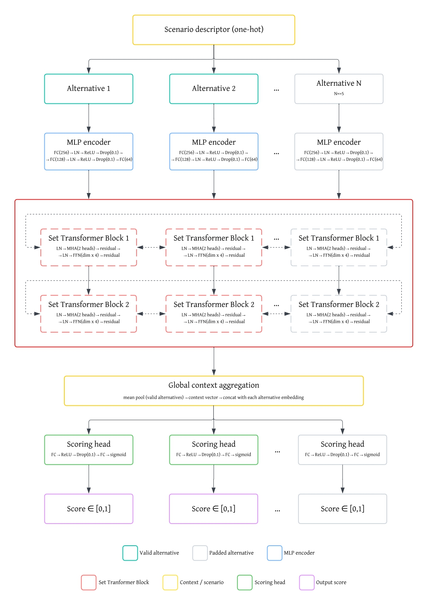

# A Context-Adaptive Deep Learning Recommender Model for Sustainable Product Selection


> **Application to concrete in the early design phase**

[]()
[]()


## Overview

The construction industry contributes significantly to global environmental degradation, accounting for over 31% of annual CO₂ emissions. Despite the availability of sustainable concrete alternatives (e.g., recycled aggregates, low-carbon cements), product selection in early-stage construction is predominantly driven by **cost and availability**, often ignoring environmental and social performance.

This repository hosts the implementation of a **Deep Learning-based Recommender Model** designed to automate the multi-criteria selection of construction products, with concrete as the primary application domain. The model ranks product alternatives using **self-attention mechanisms** and **Set Transformer-based blocks**, integrating sustainability indicators, product performance specifications, stakeholder priorities, and contextual application parameters to generate context-adaptive preference scores.

### Key Objectives
- **Automate decision-making:** Move beyond manual, cost-driven selection to automated, multi-criteria evaluation.
- **Integrate heterogeneous data:** Handle fragmented data sources (EPDs, technical sheets) with variable quality.
- **Context-awareness:** Adapt recommendations based on physical constraints (e.g., acoustic requirements) and decision-maker profiles (e.g., sustainability maximalist vs. cost-conscious).

---

## Features

*   **Transformer-based architecture:** Utilises stacked self-attention blocks to capture contextual relationships between competing product alternatives.
*   **Multi-dimensional inputs:** Processes 66+ input features per alternative, covering sustainability metrics, performance (EN 206), and costs. The system explicitly encodes data availability through dedicated presence and relevance flags, allowing robust handling of sparse or incomplete datasets.
*   **8 Stakeholder archetypes:** Pre-defined profiles to simulate diverse decision-making strategies (e.g., *Circular economy advocate*, *Cost-conscious developer*).
*   **Scenario-specific logic:** "Concrete Application" vectors adjust feature weights based on application needs (e.g., *Acoustic Insulation*, *Thermal Insulation*, *Architectural Finish*).
*   **Hybrid learning strategy:** Trained on a composite data set of:
    *   **Control cases:** Deterministic scenarios for ground-truth anchoring.
    *   **LLM-generated labels:** Scalable synthetic data with confidence scoring for complex cases.
    *   **Expert-annotated cases:** High-value data for complex trade-off resolution. These cases serve as gold-standard reference points to fine-tune the model and mitigate LLM hallucinations.

---


## Model Architecture

The model consists of four sequential components: an input encoder, stacked Set Transformer blocks, a global context aggregation module, and a scoring head, as illustrated in [Figure 1](#fig-architecture).

<a id="fig-architecture"></a>

*Figure 1. Schematic overview of the ranking-based neural network architecture.*

**Input encoding.** Each alternative is described by 66 input features which are concatenated
with a scenario descriptor prior to encoding (early fusion). The resulting vector is processed by a three-layer MLP (FC(256)→LN→ReLU→Drop→FC(128)→LN→ReLU→Drop→FC(64)),
yielding a 64-dimensional embedding per alternative.

**Pairwise comparison via Set Transformer blocks.** Two stacked residual blocks, each structured as LN→MHA→residual→LN→FFN→residual, are applied to the set of alternative embeddings. This enables the model to evaluate each alternative in relation to the full
set of competing alternatives within a query, capturing relative preference signals rather
than absolute feature values.

**Global context aggregation.** A scenario context vector is constructed by mean-pooling the embeddings of all valid (non-padded) alternatives. This vector is concatenated to each individual alternative's embedding, supplying global set-level information to the scoring stage.

**Preference scoring.** The concatenated representations are passed through a two-layer
MLP scoring head. A sigmoid activation normalises the output to the unit interval $[0, 1]$,
yielding an interpretable preference score per alternative used as the ranking criterion.


---
## Training Strategy
*   **Loss function:** Custom Group-Weighted Smooth L1 Loss.
*   **Weighting:** Leverages control and LLM scenarios as a broad foundational corpus for representation learning, while utilising expert cases for fine-tuning to refine decision boundaries and enhance performance relative to the baseline data.
    *   *Default weights:* Control (2/5), LLM (2/5), Expert (1/5).
*   **Optimization:** Adam optimiser with ReduceLROnPlateau scheduler.

---

## Getting Started

### Prerequisites
- Python 3.12
- PyTorch 2.7.0 (with CUDA 12.8 support recommended for GPU acceleration)

### Installation

1. **Clone the repository:**
   ```bash
   git clone https://github.com/eirasroger/concrete-selection-dl-model
   cd concrete-selection-dl-model
   ```

2. **Create virtual environment (Windows):**
   ```bash
   python -m venv venv
   venv\Scripts\activate
   ```

3. **Install dependencies:**
   ```bash
   pip install -r requirements.txt
   ```

4. **Download training datasets:**
   Download `frozen_dataset.json` and `labelled_dataset.json` from:
   [https://doi.org/10.34810/data3164](https://doi.org/10.34810/data3164)
   
   Place both files in the repository root directory.
   

### Training the model

Run the training script:
```bash
python main.py
```

Training progress, loss plots, and performance evaluations will be displayed. The trained model will be saved in the `stored_models/` directory upon completion.

### Model evaluation

1. **Download evaluation dataset:**
   Download `evaluator_dataset.json` from:
   [https://doi.org/10.34810/data3164](https://doi.org/10.34810/data3164)
   
   Place the file in the repository root directory.

2. **Run evaluation:**
   ```bash
   python evaluator.py
   ```

The evaluation generates comprehensive analysis including:
- Performance plots under parameter variations
- Stakeholder influence analysis
- Application influence analysis
- SHAP-based feature importance and interpretability


## Generating custom data sets

For advanced users wishing to generate their own data sets from scratch, follow this structured pipeline across three data sources. This process requires familiarity with the data formats and OpenAI API access for synthetic labelling.

### 1. Control cases

**Location:** `dataset_handling/control_dataset_generation/`

**Scripts available:**
- Example: `dataset_generation_control_case_gwp.py`
- Additional control case generators (similar structure)

**Process:**
```bash
cd dataset_handling/control_dataset_generation/
python dataset_generation_control_case_gwp.py
```

**Output:** `gwp_control_scenarios.json`, `gwp_control_labels.json`

**Customisation:** Modify number of generated cases or ideal condition parameters within the script as needed.

### 2. Synthetic data set

**Step 2.1 - Generation**
**Location:** `dataset_handling/synthetic_dataset_generation/`

```bash
cd dataset_handling/synthetic_dataset_generation/
python dataset_generation_concrete.py
```

**Output:** `dataset.json`

**Customisation:** All generation parameters are editable within the script.

**Step 2.2 - Labelling**
**Location:** `dataset_handling/synthetic_dataset_labelling/`

1. Copy `dataset.json` to the labelling directory
2. **Required:** Create `.env` file with `OPENAI_API_KEY=your_key_here`
3. Run labelling:

```bash
cd dataset_handling/synthetic_dataset_labelling/
python MAIN_data_labelling.py
```

**Output:** `labelled_dataset_LLM.json`

**Customisation:** System prompts and labelling parameters fully editable as deemed appropriate.

### 3. Expert data set

**Manual creation required:**

Create two files maintaining exact format compatibility with other data sets:
- `expert_scenarios.json`
- `expert_labels.json`

Populate with domain expertise following the schema observed in control/synthetic outputs.

### 4. Dataset unification

**Location:** `dataset_handling/dataset_unification/`

1. Copy all generated files to this directory.

2. Run unification:
```bash
cd dataset_handling/dataset_unification/
python dataset_unification.py
```

**Final output:** 
- `frozen_dataset.json`
- `labelled_dataset.json`

These unified data sets can now be used directly for training (`main.py`) and evaluation (`evaluator.py`) as described in previous sections.


---

## Use Cases

The following scenarios illustrate how the model adapts to realistic decision contexts.

- **Scenario 1: Resolving a multi-metric stalemate**

  A sustainability review stalls because different team members are anchoring to different indicators: one prefers the lowest-GWP product, another flags a poor health profile, and a third raises end-of-life concerns that the group has no consistent way to weigh.

  Rather than defaulting to the loudest voice or the most familiar metric, the model produces a unified preference ranking that reflects the agreed stakeholder profile, making trade-offs legible and comparable across the entire shortlist in a single output.

  The practical result is a decision-ready shortlist with a traceable rationale, rather than a negotiated compromise with no audit trail.


- **Scenario 2: Occupant comfort as the primary driver**

  A project team specifying concrete for an application where thermal insulation is a key design intent needs to reconcile that requirement with a client brief that explicitly centres occupant comfort. Several products on the shortlist perform comparably on carbon, but their performance indicator profiles diverge considerably.

   The occupant comfort stakeholder profile and thermal comfort application context work together here: the ranking shifts to reflect both dimensions simultaneously, naturally favouring lower-density products whose properties align with the thermal intent of the application.

  The result gives the team a defensible, criteria-consistent selection rather than one driven by whichever product was most familiar or most prominently marketed.


- **Scenario 3: Same products, different application context**

   The shortlist is identical, but the application shifts from a thermally driven context where lower density is advantageous to an architectural finish where surface quality and aesthetic performance take precedence.

  Switching the *Concrete Application* input re-weights the indicators relevant to each context, producing a transparently different ranking from the same underlying data without any manual adjustment to the scoring logic.

  This makes context-driven preferences explicit at the point of specification, reducing the risk of late-stage substitutions driven by assumptions that were never formally stated.

---
## Contact 

Roger Vergés - Corresponding author and lead developer - [roger.verges.eiras@upc.edu](mailto:roger.verges.eiras@upc.edu)


---
## Additional information 

Related publication: The associated academic paper is currently under review. The DOI will be added here upon acceptance.


### Paper contributors:
- Roger Vergés <sup>1, 2</sup> (<a href="mailto:roger.verges.eiras@upc.edu">roger.verges.eiras@upc.edu</a>) <a href="https://orcid.org/0009-0001-5887-4785" aria-label="ORCID"></a>
- Kàtia Gaspar <sup>1</sup> (<a href="mailto:katia.gaspar@upc.edu">katia.gaspar@upc.edu</a>) <a href="https://orcid.org/0000-0003-3842-1401" aria-label="ORCID"></a>
- Núria Forcada <sup>1</sup> (<a href="mailto:nuria.forcada@upc.edu">nuria.forcada@upc.edu</a>) <a href="https://orcid.org/0000-0003-2109-4205" aria-label="ORCID"></a>
- M. Reza Hosseini <sup>2</sup> (<a href="mailto:mreza.hosseini@unimelb.edu.au">mreza.hosseini@unimelb.edu.au</a>) <a href="https://orcid.org/0000-0001-8675-736X" aria-label="ORCID"></a>


<sup>1</sup> Group of Construction Research and Innovation (GRIC), <a href="https://www.upc.edu/ca">Universitat Politècnica de Catalunya — BarcelonaTech (UPC)</a>, Terrassa, Catalonia

<sup>2</sup> Faculty of Architecture, Building and Planning, <a href="https://www.unimelb.edu.au/">The University of Melbourne</a>, Parkville, Australia